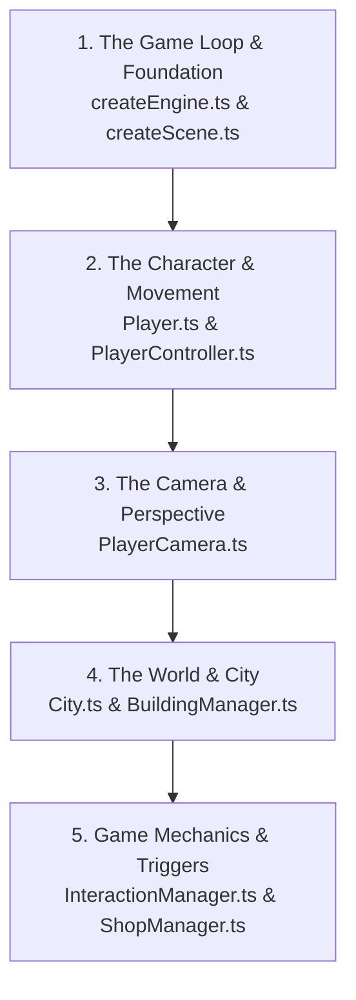

If you are learning 3D game development for the very first time, the single best file to read first is:

### 🏆 Start Here: [`createEngine.ts`](file:///d:/xampp/htdocs/nextjs/socialworld/src/game/engine/createEngine.ts)
> **Why?** Every video game in history—from *Pac-Man* to *Grand Theft Auto*—operates on one core concept: **The Game Loop** (`runRenderLoop`).
> 
> In this file, you will learn:
> 1. **What an Engine is**: How WebGL talks directly to your graphics card (GPU).
> 2. **The 60 FPS Render Loop**: Why games don't wait for clicks like websites do; they recalculate and redraw the entire universe 60 times every second.
> 3. **Hardware Scaling & Anti-Aliasing**: How to make 3D graphics look crisp on high-resolution screens without lagging.

---

### 🗺️ The Recommended 5-Step Learning Roadmap

To build a rock-solid mental model of how this 3D game was built, read the files in this exact sequence:

---

#### Step 1: The Foundation & Canvas
1. **[`createEngine.ts`](file:///d:/xampp/htdocs/nextjs/socialworld/src/game/engine/createEngine.ts)**: Understand the WebGL rendering engine and 60 FPS loop.
2. **[`createScene.ts`](file:///d:/xampp/htdocs/nextjs/socialworld/src/game/engine/createScene.ts)**: Learn what a 3D "Scene" is—the blank digital stage containing all meshes, gravity, and lights.
3. **[`types/game.ts`](file:///d:/xampp/htdocs/nextjs/socialworld/src/types/game.ts)**: Skim this like a dictionary to see how 3D coordinates (`x, y, z`), animation states, and items are defined.

---

#### Step 2: The Player & Physics Math (The Most Exciting Part)
1. **[`Player.ts`](file:///d:/xampp/htdocs/nextjs/socialworld/src/game/player/Player.ts)**: See how an avatar is born! Combines a 3D body mesh, a glowing visor, physics collision capsules, and lighting shadows.
2. **[`PlayerController.ts`](file:///d:/xampp/htdocs/nextjs/socialworld/src/game/player/PlayerController.ts)**: Learn real game physics:
   * How WASD keys are turned into movement vectors.
   * Why we multiply speed by **`deltaTime`** so the game runs at the exact same speed on a 30 FPS laptop and a 144 FPS gaming PC.
   * How gravity and jumping work using acceleration equations ($v = v_0 + gt$).

---

#### Step 3: Camera & Perspective
* **[`PlayerCamera.ts`](file:///d:/xampp/htdocs/nextjs/socialworld/src/game/player/PlayerCamera.ts)**:
  * Learn how a **Third-Person Follow Camera** works.
  * Understand spherical trigonometry (`alpha`, `beta`, `radius`) to smoothly orbit around the player when you drag the mouse.

---

#### Step 4: World Generation & Neon Aesthetics
1. **[`City.ts`](file:///d:/xampp/htdocs/nextjs/socialworld/src/game/world/City.ts)**: How roads, sidewalks, and intersections are procedurally generated using mathematical grid coordinates.
2. **[`BuildingManager.ts`](file:///d:/xampp/htdocs/nextjs/socialworld/src/game/buildings/BuildingManager.ts)**: How skyscrapers, shops, glass facades, and self-illuminated neon signs are spawned in 3D space.
3. **[`DayNightCycle.ts`](file:///d:/xampp/htdocs/nextjs/socialworld/src/game/world/DayNightCycle.ts)**: How sun position, skybox colors, and street lamps dynamically blend between day, golden sunset, and cyberpunk night.

---

#### Step 5: Game Gameplay Systems & UI Bridge
1. **[`InteractionManager.ts`](file:///d:/xampp/htdocs/nextjs/socialworld/src/game/interaction/InteractionManager.ts)**:
   * Learn the **Distance Trigger Formula** (Pythagorean Theorem: $d = \sqrt{\Delta x^2 + \Delta z^2}$). When you walk within 4.5 meters of a shop, it pops up the `[E]` action prompt.
2. **[`ShopManager.ts`](file:///d:/xampp/htdocs/nextjs/socialworld/src/game/shops/ShopManager.ts)**: The economy system (wallets, item inventories, and purchase transactions).
3. **[`GameUI.tsx`](file:///d:/xampp/htdocs/nextjs/socialworld/src/components/GameUI.tsx)** & **[`GameCanvas.tsx`](file:///d:/xampp/htdocs/nextjs/socialworld/src/components/GameCanvas.tsx)**: How 2D web interfaces (React) talk to high-speed 3D graphics (Babylon.js).

---

### Quick Tip for Learning
Open **[`createEngine.ts`](file:///d:/xampp/htdocs/nextjs/socialworld/src/game/engine/createEngine.ts)** first and read the top explanation block. Then jump straight into **[`PlayerController.ts`](file:///d:/xampp/htdocs/nextjs/socialworld/src/game/player/PlayerController.ts)** to see how keyboard keys make 3D objects move!